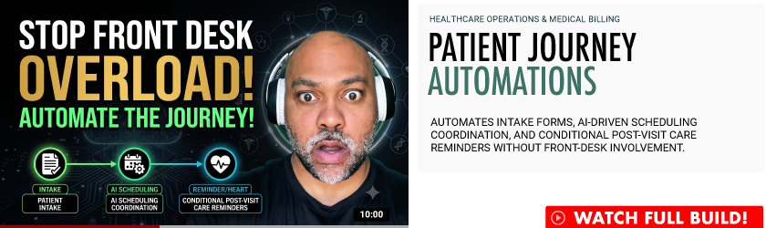

  

# Patient Journey Automations
### Healthcare Operations & Medical Billing  
Automates intake forms, AI-driven scheduling coordination, and conditional post-visit care reminders without front-desk involvement.  

**Status:** `● ARCHITECTURE PREVIEW` (reference shell)  
**Live reference:** [Patient Journey Demo](https://ias-build-002-doc-intake.vercel.app/)

The shared demo shell every IAS build deploys from. One config file per build drives the entire page — hero, honest status chip, architecture map, sample payload, and CTA. Clone it, fill `build.config.ts`, deploy to Vercel. Done.

**DEV STACK**  
  
---
  

---

## License

Portfolio-demonstrative code. All rights reserved — see `LICENSE.md`. Public demos show capability; licensed client software lives in private repositories.
